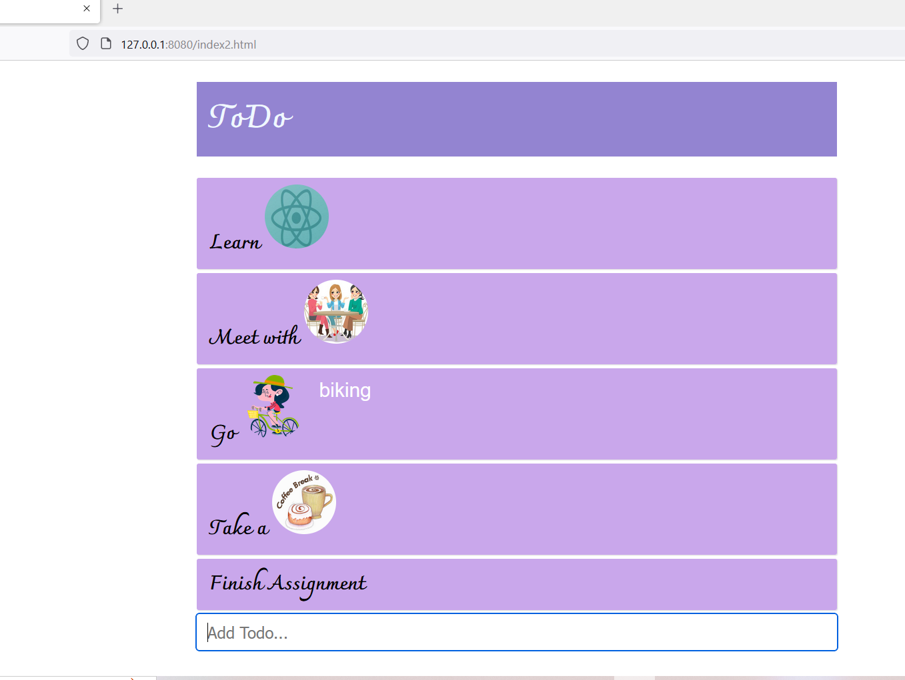

# This is a ToDo list 
## The Add Todo textbox reads user input and on the click of enter it adds the new todo to the existing list
## On clicking one of the existing list it removes the item from the list.
## below is a snapshot of how the screen looks

